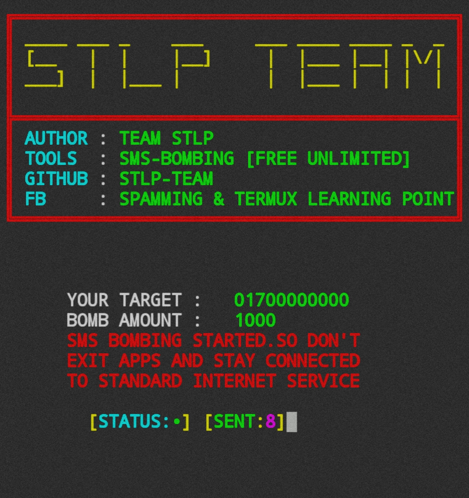

</p>

<p align="center">    
   <a 
href="https://github.com/Drxlar"></a> 

</p>

<p align="center">
• <a
href="https://github.com/Drxlar/A-DDos/wiki">THE WORLD IS YOUR CANVAS</a> •

</p>

# SMS-BOMB
Free and Unlimited best SMS BOMBER Tools

<h2>INSTALLATION ⬇️</h2>


```
pkg update -y
pkg upgrade -y
pkg install git -y
pkg install python -y
pip3 install requests
cd && rm -rf SMS-BOMB
git clone https://github.com/STLP-TEAM/SMS-BOMB
cd SMS-BOMB
python run.py
```


<h3>SINGLE COMMAND</h3>

```
pkg update -y;pkg upgrade -y;pkg install git -y;pkg install python -y;pip3 install requests;cd && rm -rf SMS-BOMB;git clone https://github.com/STLP-TEAM/SMS-BOMB;cd SMS-BOMB;python run.py
```


<h3>DEMO SS</h3>
<center></img></center></br>

<h3><a href="https://facebook.com/groups/spamming.termux.learning.point/"> ©️STLP-TEAM</a></h3>
